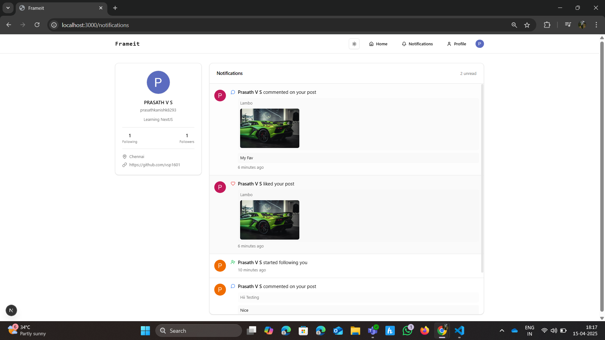
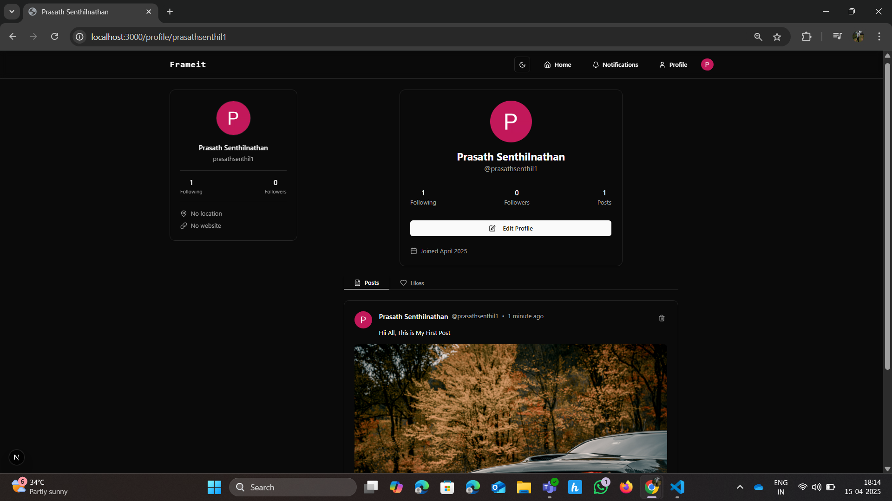

# Frameit

This is a simple social media platform built using Next.js. Users can post image content, like and comment on posts, follow/unfollow other users, and receive notifications. It is similar to Instagram in functionality.

## Tech Stack

- Next.js
- Clerk (User Authentication)
- PostgreSQL (via Neon)
- Prisma ORM
- shadcn/ui (UI Components)
- UploadThing (Image Uploads)

## Features

### Posts
- Users can upload and share image-based posts.
- Users can like and comment on posts.
- Posts are visible on the home feed and user profiles.

### Notifications
- Users receive notifications when someone follows them, likes their post, or comments.
- Notification bar displays the number of unread notifications.

### Profile
- Users can view their own profile including:
  - Their posts
  - Liked posts
  - Number of followers and following
- Users can update their profile info (name, bio, profile picture).
- When visiting other profiles:
  - View their posts and likes
  - Follow or unfollow them

### Screnshot
- Home Page Without Login

-Home Page with User authorized

-Create Post

-Notifications Page (Light Mode)

-Profile Page

-Update Profile

